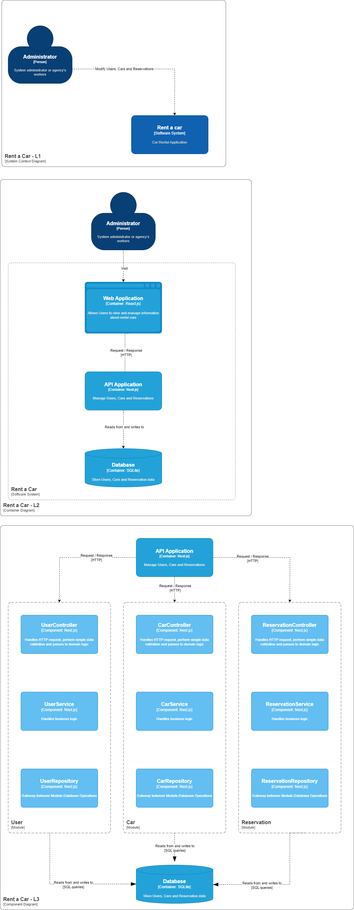

# Rent a car

CRUD / ABM implementado en Nest.js para añadir, ver, actualizar y eliminar autos.

## Installation

```bash
$ yarn install

# watch mode
$ yarn dev

```

## Diagram

The following diagrams are included to show the application architecture:


